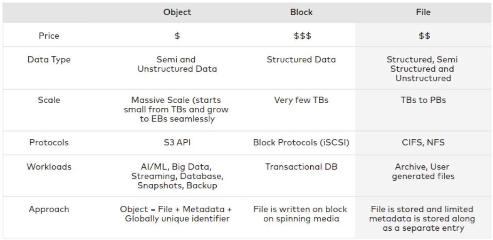
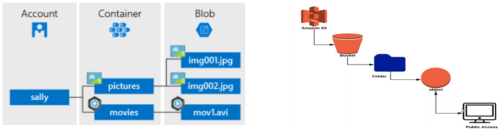
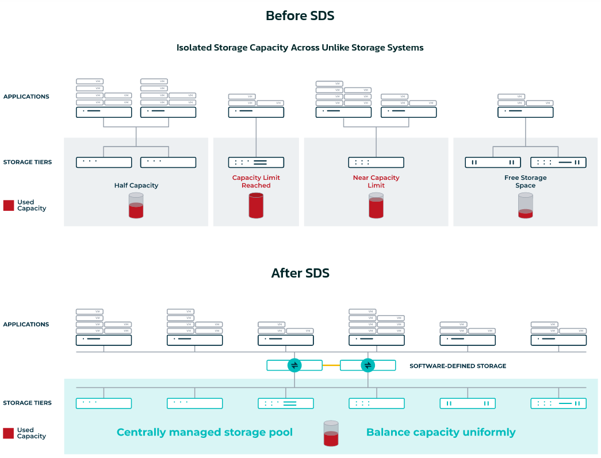

# Cloud Storage

## CNCF Cloud Native Definition v1.0

> Cloud native technologies empower organizations to build and run scalable applications in modern, dynamic environments such as public, private, and hybrid clouds. Containers, service meshes, microservices, immutable infrastructure, and declarative APIs exemplify this approach.

>These techniques enable loosely coupled systems that are resilient, manageable, and observable. Combined with robust automation, they allow engineers to make high-impact changes frequently and predictably with minimal toil.

**Note**: The definition is not related to cloud per-se, but to application architecture.  

[Reference](https://github.com/cncf/toc/blob/main/DEFINITION.md)

## Cloud storage formats

### Comparison of different cloud storage formats

### AWS storage offer

### AWS storage offer

## Cloud native storage

- Requirements:
    - S3 compatible API
    - built for Kubernetes
- Cloud native storage is **object storage**
    - can handle huge amounts of data
    - affordable
    - sufficiently fast for the applications
    - distributed
    - resilient
    - highly available
- Storage and compute are **decoupled** (we can scale them independently)

## Object storage

### What is an object?

Components:

- **data**:
    - structured data: database snapshots
    - unstructured: videos, audio files
    - semi-structured: logs
    - max size for individual object (5 TB S3 bucket object, 200 TB Azure blob storage)
    - binary objects (not the same as blocks)
- **network address**: 
    - example: http://s3amazonaws.com/<bucket-name>/<object-name> (for publicly available objects on AWS)
- **metadata**: 
    - user that created it, last access…
    - checksum
    - lifecycle policy (expiration date)

### How is an object stored?

- Objects are stored as **key-value pairs**
    - key: network address
    - value: the data
- They are **immutable**

[Addtional reading: Azure Blob Storage vs AWS S3 – Which is Better? (Pros and Cons)](https://cloudinfrastructureservices.co.uk/azure-blob-storage-vs-aws-s3-which-is-better/)

## Virtualized storage And Software defined storage

- **Virtualized** storage: 
    - decoupling the hardware and capacity
    - we can join different storage devices into one big storage pool
    - the resources will be shared among users/applications
- **Software-defined** storage: 
    - separates the hardware from functional aspects of the storage
    - security
    - identity and access management 
    - predicate pushdown
    - data fault-tolerance
    - could implement objects, blocks and files
    - proprietary and open-source projects

[Reference](https://www.datacore.com/software-defined-storage/)

### MinIO: Software defined storage solution

- Cloud-native object storage
- Highly scalable
- Distribued
- Erasure coding and RotBit protection
- Lifecycle management
- ...

[Reference](https://min.io/product/overview)

---

*The content of this document, including all text, images, and associated materials, is the exclusive property of Adaltas and is protected by applicable copyright laws. Unauthorized distribution, reproduction, or sharing of this content, in whole or in part, is strictly prohibited without the express written consent of the author(s). Any violation of this restriction may result in legal action and the imposition of penalties as prescribed by law.*
