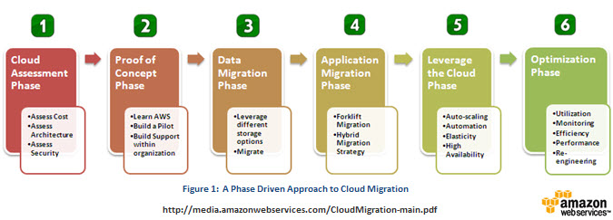
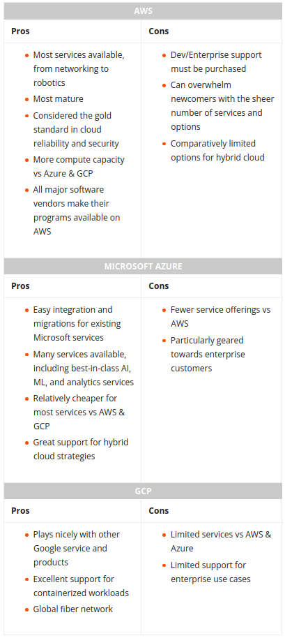

# Cloud Migration

## Why migrate from on-prem to cloud?

- Scalability and flexibility
    - scalable storage and compute
    - flexible infra and services
- Cost reduction (?)
    - no electricity bill
    - less in-house maintenance costs
    - licences (?)
- Automated security and compliance
    - certain level of security and compliance provided by cloud providers
- Simplified and reliable resource management
    - backup and recovery tools
    - high availability
    - UI to manage resources and budget

[Reference](https://duplocloud.com/blog/on-premise-to-cloud-migration/)

## Why NOT migrate from on-prem to cloud?

- Sensitive data
    - Data localisation defines compliance rules (RGPD, CLOUD act)
- Downtime issues with cloud/service providers
    - You cannot do anything about it
- Certain applications run better locally
    - Apps that cannot be fully migrated (will still need to connect to on-prem resources)
    - Apps that are not scalable
- Long term costs are higher (?)

## Cloud service models

## Migration strategies (6 Rs)

- **Rehost** (lift-and-shift):
    - create an image with virtualization service
    - export it
    - imported into a cloud compute service. We can containerize things.
    - The process is relatively simple; it doesn’t require a lot of technology, and it doesn’t require a lot of expertise.
- **Replatform** (modified lift and shift):
    - making some optimizations to the application during the migration stage
    - example: replace your DB with cloud-provider’s DB
    - requires some level of expertise
- **Repurchase** (drop-and-shop):
    - move to another product
- **Refactor**:
    - re-architecting the solution
    - better adaptation to cloud environment
    - requires time and expertise
- **Retain**:
    - retain some applications on-prem (compliance)
- **Retire**:
    - identify assets and services that can be turned off

#### Example: Database migration paths on AWS

## Migration steps

[Reference](https://media.amazonwebservices.com/CloudMigration-main.pdf)

## Choosing cloud provider

[Reference](https://www.bmc.com/blogs/aws-vs-azure-vs-google-cloud-platforms/)

---

*The content of this document, including all text, images, and associated materials, is the exclusive property of Adaltas and is protected by applicable copyright laws. Unauthorized distribution, reproduction, or sharing of this content, in whole or in part, is strictly prohibited without the express written consent of the author(s). Any violation of this restriction may result in legal action and the imposition of penalties as prescribed by law.*
